**Antoni Cabida Sales**

Sistemas de control de versiones

¿Qué es Git? ¿Qué metodología usaré? ¿Por qué utilizaré esa metodología?

Git es un sistema de control de versiones distribuido ampliamente utilizado en el desarrollo de software. Permite a los equipos de desarrollo colaborar de manera eficiente en proyectos, rastreando los cambios en el código fuente y coordinando el trabajo de múltiples desarrolladores. Cada desarrollador tiene una copia local completa del repositorio, lo que facilita el trabajo sin conexión y la integración de cambios.

La metodología de desarrollo que utilizaré en este proyecto es GitFlow. GitFlow es un modelo de ramificación popular que define un conjunto de reglas para la gestión de ramas en un repositorio Git. Está diseñado para facilitar el desarrollo colaborativo y el mantenimiento del código, especialmente en proyectos con lanzamientos regulares.

Debido a su estructura clara y su capacidad para gestionar proyectos con múltiples versiones y características en desarrollo simultáneo. GitFlow separa las ramas para nuevas características, lanzamientos y correcciones de errores, lo que simplifica el seguimiento de los cambios y la gestión del flujo de trabajo. Además, proporciona un marco establecido para el control de versiones y la colaboración entre equipos de desarrollo.

Al adoptar GitFlow, espero mejorar la organización del proyecto, reducir los conflictos de código y facilitar la implementación de nuevas características y correcciones de errores de manera ordenada y eficiente.

Esta metodología nos permite mantener una rama de producción estable (main) y una rama de desarrollo (develop), asegurando que los cambios se integren y prueben de manera adecuada antes de ser lanzados a producción.

\_\_\_\_\_\_\_\_\_\_\_\_\_\_\_\_\_\_\_\_\_\_\_\_\_\_\_\_\_\_\_\_\_\_\_\_\_\_\_\_\_\_\_\_\_\_\_\_\_\_\_\_\_\_\_\_\_\_\_\_\_\_\_\_\_\_\_\_\_\_\_\_\_

Aquí comenzaré con los pasos a seguir para la práctica.

El usuario 1 abrirá GitHub en su navegador y creará un nuevo repositorio. Asignará un nombre al repositorio y una descripción opcional. Una vez creado, copiará la URL del repositorio.

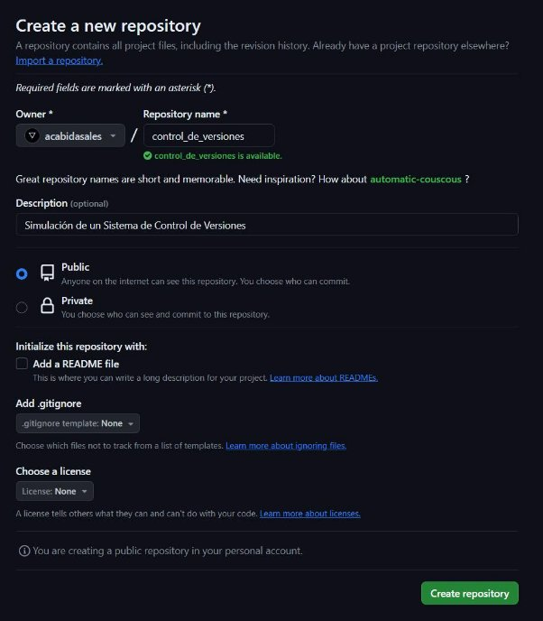

Una vez creado, ell usuario 1 abrirá su terminal, navegará al directorio donde desea clonar el repositorio y ejecutará el siguiente comando para clonar el repositorio:

“git clone https://github.com/acabidasales/control\_de\_versiones.git”

El usuario 1, instalará la boilerplate proporcionada con los siguientes comandos: “npm install html5-boilerplate”

Y una vez instalado, introduciremos el siguiente comando para iniciar un nuevo sitio con el boilerplate:

“npm init html5-boilerplate nuevo-sitio”

Entrará en la carpeta creada y usará “npm install” para instalar las dependencias correspondientes.

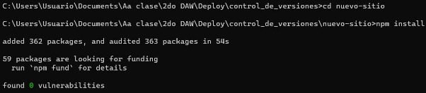

Una vez hecho esto, el usuario 1 creará las ramas iniciales según la metodología GitFlow tras salir del directorio anterior.

Ahora, el usuario 1 modifica el archivo index.html quedando de la siguiente forma:

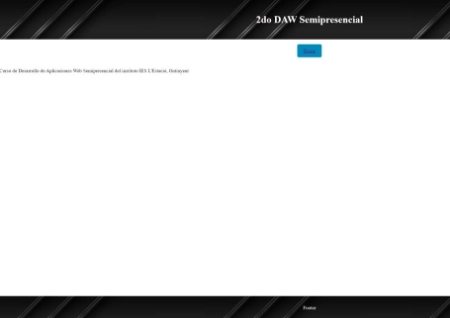Tras eso, el usuario 1 agregará, confirmará y subirá los cambios al repositorio con los siguientes comandos:

“git add .” (Imposible añadir captura debido al gran contenido de la carpeta node\_modules) “git commit -m "Implementada la estructura inicial"”

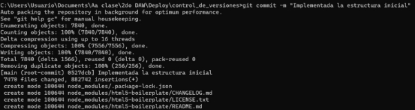

“git push origin develop”

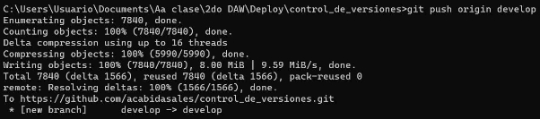

“git push origin main”

Y podremos comprobar en github las ramas y el contenido.

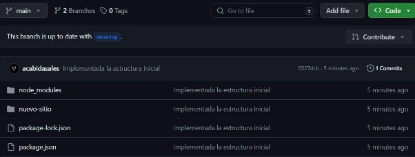

El Usuario 2 abrirá su terminal y clonará el repositorio de forma local. Tras eso navegará al directorio del repositorio clonado.

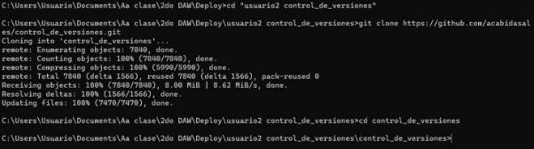

Creará una nueva rama para la feature de la sección "Modificar contenido HTML" a partir de la rama develop usando el comando:

“git checkout -b feature/modificar\_contenido\_HTML develop”

El usuario 2 modificará el archivo index.html y lo requerido para realizar la implementación de la sección "Modificar contenido HTML", haciéndola también útil para cambiar el texto al hacer clic sobre el botón.

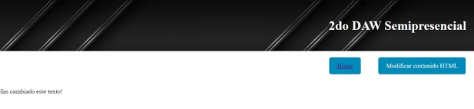

Agregará y confirmará los cambios regularmente mientras trabaja en la feature:

El Usuario 2 creará una nueva rama para la feature de la sección "Modificar atributos HTML" a partir de la rama develop usando el comando:

“git checkout -b feature/modificar\_atributos\_HTML develop”

El Usuario 2 modificará el archivo index.html y lo requerido para realizar la implementación de la sección "Modificar atributos HTML", haciéndola también útil para cambiar los atributos del texto al hacer clic sobre el botón.

Agregará y confirmará los cambios de la feature con los siguientes comandos: “git add .”

“git commit -m "Agregar sección Modificar atributos HTML"”

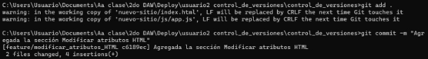El Usuario 2 subirá ambas ramas al repositorio de github con los siguientes comandos: “git push origin feature/modificar\_contenido\_HTML”

“git push origin feature/modificar\_atributos\_HTML”

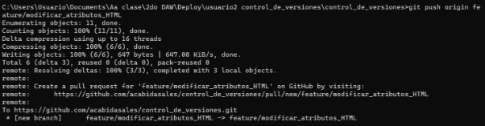

Una vez que ambas features estén listas, el Usuario 2 fusionará las ramas de las features a la rama develop con los siguientes comandos:

“git checkout develop”

“git merge feature/modificar\_contenido\_HTML”

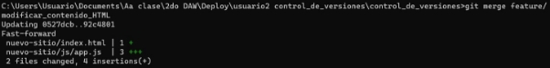

“git merge feature/modificar\_atributos\_HTML”

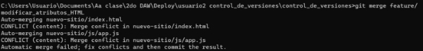Aquí podemos ver un conflicto, también visto desde visual estudio en ambos archivos: index.html (Aceptaré ambos cambios)

Solución:

App.js (Aceptaré ambos cambios)

Solución

Añadimos otra vez los archivos con git add:

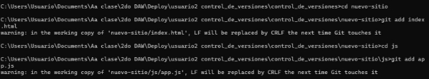

Y hacemos un commit:

Después de resolver los conflictos y confirmar los cambios, mando los cambios a github con el siguiente comando:

“git push origin develop”

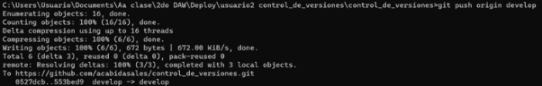

Ahora, el Usuario 3 abrirá su terminal y clonará el repositorio de forma local. Tras eso navegará al directorio del repositorio clonado.

“git clone <https://github.com/acabidasales/control_de_versiones.git>”

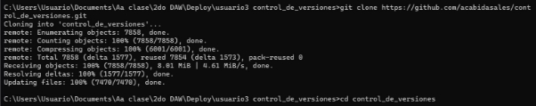

Creará una nueva rama para la feature de la sección "Modificar estilos CSS" a partir de la rama develop usando el siguiente comando:

“git checkout -b feature/modificar\_estilos\_CSS develop”

El Usuario 3 modificará el archivo index.html y lo requerido para realizar la implementación de la sección "Modificar estilos CSS", haciéndola también útil para cambiar los estilos del texto al hacer clic sobre el botón.

Agregará y confirmará los cambios de la feature con los siguientes comandos: “git add .”

“git commit -m "Agregar sección Modificar estilos CSS"”

El Usuario 3 subirá la rama de la feature al repositorio remoto con el siguiente comando: “git push origin feature/modificar\_estilos\_CSS”

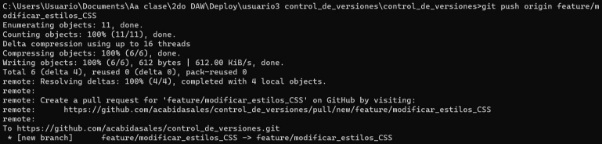

Y una vez la feature esté lista, cambia de rama a la develop y la fusionará usando el siguiente comando:

“git merge feature/modificar\_estilos\_CSS”

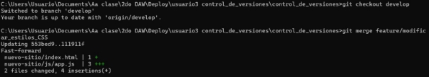

Y subirá los cambios al repositorio remoto:

Ahora, con todos los cambios preparados en la rama develop, el usuario 1 mandará todos los cambios, tras comprobar que todas las features funcionan, primero actualizando su repositorio, a la rama main con el siguiente comando:

“git pull origin develop”

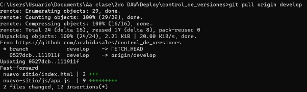

“git checkout main”

“git merge develop”

Ahora hace un commit para confirmar la fusión con el siguiente comando: “git commit -m "Integrados los cambios de la rama develop a la rama main"”

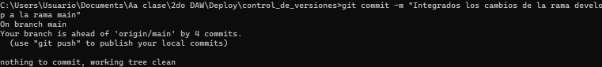

Y lo sube al repositorio remoto: “git push origin main”

Ahora creará la etiqueta de la versión del repositorio con el siguiente comando: “git tag v1.0”

El Usuario 1 creará una nueva rama llamada test, que será utilizada por los testers para probar el desarrollo antes de implementarlo en producción (Dado a que no hay testers, se ha incorporado directamente anteriormente):

Una vez realizados los pasos anteriores, el Usuario 1 subirá la rama test y las etiquetas (v1.0) al repositorio remoto con los siguientes comandos:

“git push origin test”

“git push origin v1.0”

El Usuario 1 creará una carpeta en el proyecto llamada gitHooks donde se almacenarán los scripts de los hooks, aparte de la integrada en el archivo .git. Ahí creará un archivo llamado “post-checkout” con el siguiente contenido:

Que nos asegurará instalar las dependencias. No necesito dar permisos de ejecución ya que estoy sobre windows.

Ahora configurará git para usar los hooks con el siguiente comando: “git config core.hooksPath gitHooks”

Ahora creará dentro de esa carpeta un archivo llamado “commit-msg” con el siguiente contenido:

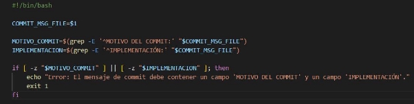Y también dentro de esa carpeta, creará un archivo llamado “pre-commit” con el siguiente contenido, que verificará los carácteres extraños.

Ahora usaremos los siguientes comandos para instalar el plugin eslint: “npm install -g eslint”

“npm install --save-dev eslint-plugin-html”

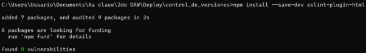

Ahora, el usuario 1 también añadirá al hook “pre-commit” el siguiente contenido para revisar el formato HTML:

También añadiré los nuevos cambios hechos por el plugin y lo añadiré con un commit siguiendo el formato:

Añadirá los hooks al área de preparación y hará un commit usando los siguientes comandos:

“git add gitHooks/post-checkout gitHooks/commit-msg gitHooks/pre-commit”

“git commit -m "MOTIVO DEL COMMIT: Subir hooks IMPLEMENTACIÓN: Carpeta de hooks"” (Asi comprobaré si funcionan los hooks)

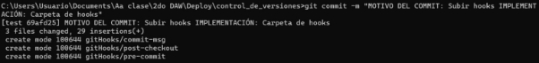

Añado los cambios al repositorio remoto:

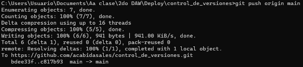

Ahora creo la rama gh-pages con el siguiente comando: “git checkout -b gh-pages”

Añado el documento nuevo con la documentación a y hago el commit.

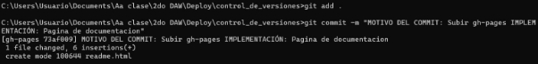

Y lo subo al directorio remoto:

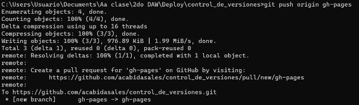

(Vuelve a darme un error en el deploy de github pages) sin entender el porqué
